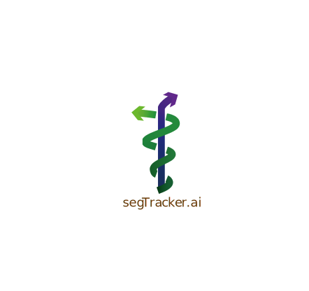

# 👋Welcome to segTracker!

This is the official implementation of SSTC: Enhanced Multi Animal Tracking and Social Behavior Analysis

## segTracker.ai

**What's new**
- segTracker.ai now supports model training!
- segTracker.ai also supports image annotation!
- Refectored a lot of codes and re-organized submodules with OpenMMLab tools!

Here are some videos showcasing the pose tracking performance (tested on Lenovo Thinkbook16p 2021 with 16GB RAM and RTX3060 MaxQ)! 

> The following videos are tracked with an unsupervised method which is animal-agnostic.

|  Name   | Size(MB) | Duration | Resolution  |  FPS  | Recording Device | idTracker.ai V4.0.12 time | segTracker.ai time | Bilibili                                                     |
| :-----: | :------: | :------: | :---------: | :---: | :--------------: | :-----------------------: | :----------------: | ------------------------------------------------------------ |
|  4xWT   |   208    | 01:00:00 |  648 x 724  |  30   | Smartisan OD103  |            NA             |      3:27:08       | [link](https://www.bilibili.com/video/BV1QC4y1U72X/?share_source=copy_web&vd_source=ad3d39ad107403a8c972cdb9c2a407d5) |
|  6xWT   |   344    | 00:10:02 | 1080 x 1080 |  60   |  iPhone 13 Plus  |            NA             |      3:03:07       | [link](https://www.bilibili.com/video/BV1Dw411T7R3/?share_source=copy_web&vd_source=ad3d39ad107403a8c972cdb9c2a407d5) |
|  2xWT   |   157    | 00:30:10 |  608 x 864  |  30   |    iPhone 13     |            NA             |      0:51:42       | [link](https://www.bilibili.com/video/BV1BG411Q7uh/?share_source=copy_web&vd_source=ad3d39ad107403a8c972cdb9c2a407d5) |
|  4xPD   |   212    | 00:10:24 |  820 x 800  |  15   |   S-YUE Webcam   |          2:59:45          |      0:38:40       | [link](https://www.bilibili.com/video/BV1mQ4y187dq/?share_source=copy_web&vd_source=ad3d39ad107403a8c972cdb9c2a407d5) |
| Noduls  |   10.5   | 00:10:00 |  236 x 184  |  25   |  Noduls camera   |          5:08:22          |      0:53:57       | [link](https://www.bilibili.com/video/BV1qN411g7a7/?share_source=copy_web&vd_source=ad3d39ad107403a8c972cdb9c2a407d5) |
| 14ants  |   109    | 00:12:57 |  840 x 714  | 59.94 |        -         |          6:27:35          |      1:51:18       | [link](https://www.bilibili.com/video/BV1QN4y1D7zm/?share_source=copy_web&vd_source=ad3d39ad107403a8c972cdb9c2a407d5) |
| 10flies |   32.5   | 00:10:12 |  948 x 920  |  60   |        -         |        1d, 6:03:28        |      2:09:06       | [link](https://www.bilibili.com/video/BV1zN4y1D7Zx/?share_source=copy_web&vd_source=ad3d39ad107403a8c972cdb9c2a407d5) |

|2xWT|4xWT|6xWT|
|:-:|:-:|:-:|
||||
|Noduls|4xPD|Fly|
||||
|Ant|New video|sleeping|
||||

> We did not use any of the frames in the 'New video' ([link](https://www.bilibili.com/video/BV1JC4y167un/?share_source=copy_web)) to train our instance segmentation and pose model.
>
> We also added a 'sleeping.mp4' video in which all animals are stationary to test our algorithm ([link](https://www.bilibili.com/list/267001661?oid=1503127717&bvid=BV19D421p7Sm))

## Quick start

1. Clone this repo with `git clone --recurse-submodules https://github.com/tctco/STCS.git` to your computer and `cd STCS`
2. Download the [trained models](/tctco/STCS/releases/download/v0.0.1/trained_models.tar) from the release page and place them inside `STCS/backend/trained_models`
3. Build & run the docker container by `docker compose up` (this container is quite large ~30GB, I'm sorry)
4. Open your browser and go to `localhost` (you can access segTracker.ai via WAN/LAN by your hosting IP as well)
5. Convert your video to a codec supported by Chrome Edge browser (we only tested H264)
6. Upload the video and start tracking!

You need to create a user first (you don't need to input your real email address) to upload your video:

https://github.com/tctco/STCS/assets/45505657/7af5c86f-c5c3-4de0-9ed3-4cf11bce0d15

After some time, you can visualize the tracking result and download the JSON file:

https://github.com/tctco/STCS/assets/45505657/f6dd5964-652c-4e63-bd48-0cbca1607e81

## segCluster

Check here to learn how to use STGCN-Autoencoder for learning social behavior embeddings [weakly-supervised clustering](./segCluster/quick_start.ipynb). Please download `segCluster_data` from the release page and place it under `segCluster/segCluster_data`

## Reproduce figures

Check here for the reproduction of some of the figures [code to reproduce figures](./reproduce_figures/code_to_reproduce_figures.ipynb). Please download `data_and_fig` from the release page and place it under `reproduce_figures/data_and_fig`.

## Supplementary materials 

Figshare:

https://doi.org/10.6084/m9.figshare.25341859.v1
        
        
        
        
        

https://doi.org/10.6084/m9.figshare.25341856.v1
        
        
        
        

https://doi.org/10.6084/m9.figshare.25594242.v1
        
        
        
        

> It takes centuries to upload files to Figshare... Therefore I have to remove some raw experimental videos from supplementary files (they are not very important). If you wish to analyze the raw videos from scratch, please refer to the Baidu netdisk links below.

Baidu netdisk

segTracker_supp_materials: 链接/link：https://pan.baidu.com/s/1L9ix8R9n1PEDXCe2ju_X5w 
提取码/extraction code：e7nn

segCluster_supp_materials 链接/link：https://pan.baidu.com/s/1QdXSHxzjdXpncsxayEH89g 
提取码/extraction code：mq3y

## Acknowledgment

We thank OpenMMLab, idTracker.ai, DeepLabCut, SLEAP, TRex/TGrab, SeBA, OCSORT, ByteTrack, YOLOv8... (there are too many to list here, I'm sorry) team for developing wonderful opensource software!

I also thank Professor Li Hao for providing generous help and Ph.D. Lai Chuan for providing his experiment videos.
